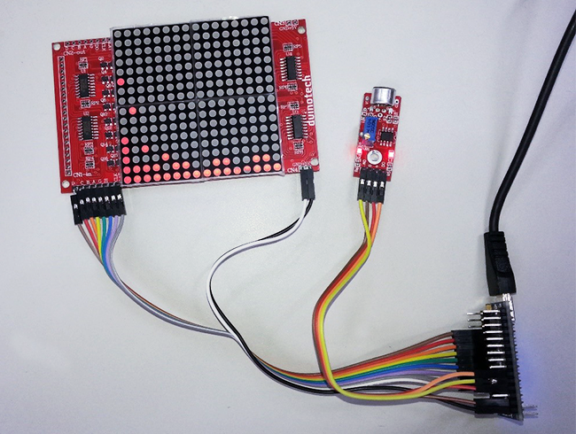

# Audio Matrix Spectrum

Using our compact XC4607 Matrix LED display, this project will give you a small spectrum display that you can sit on your desk, or even next to a speaker. As well as an instantaneous level display, there is also a peak level "waterfall" effect. There is no soldering required, and it only uses a handful of parts.




## Bill of materials
|Qty | Code | Description |
| --- | ---- | --- |
|1 | [XC4414](http://jaycar.com.au/p/XC4414) | Arduino NANO
|1 | [XC4607](http://jaycar.com.au/p/XC4607) | LED Dot matrix module
|1 | [XC4438](http://jaycar.com.au/p/XC4438) | Sound Sensor
|1 | [WC6026](http://jaycar.com.au/p/WC6026) | Socket-Socket Jumper leads.

## Connection Table

|Nano Board|	LED Matrix|	Sound Module|	Function|
|--- | --- | --- | --- |
|5v||+|power|
|vin|+5v||power|
|gnd|gnd|g|ground|
|d2|lat||display latch|
|d3|clk||display clock|
|d4|di||display data|
|d5|g||display enable|
|d6|a||column select 1|
|d7|b||column select 2|
|d8|c||column select 4|
|d9|d||column select 8|
|a7||a0|sound signal from microphone|
|a6||d0|digital signal from sound module|


Note that we are using the VIN pin on the Nano as a 5V supply to the LED Matrix- this will only work if the Nano is receiving 5V from the USB socket, and may burn out the LED's if VIN is much more than 5V. Luckily, there are two GND connections on the Nano board (there is also an extra GND and 5V connection on the ICSP header, if you need them).

Although it looks like a lot of connections, the connections to the matrix are made in the same order at both ends, so the wiring can be made neat by taking a strip of ten jumper leads and running them between the two boards, eight for the connections at one end, then two for the connections at the other end. The connections to the Sound Module can similarly be made with a strip of four jumper leads- just watch out, because they aren't in any obvious order.

## Setup

The small blue potentiometer on the Sound Module may need to be adjusted. We want the L2 LED to be flickering between on at the slightest sound. If the L2 LED is on, turn the brass screw anticlockwise. If L2 is off, turn the screw clockwise until it turns on, then turn anti-clockwise until it just goes off. The LED should now flash on if the microphone is tapped. This is the only adjustment that needs to be made, and after the code is uploaded, your Audio Matrix Spectrum is complete.

## Programming

The code consists of three files- the main sketch file and two included files. The two extra files perform what is called a 'Fast Fourier Transform', which turns audio samples into a representation of the sound frequencies in that sample. The main sketch mostly revolves around a timer interrupt, which ensures that the display refresh and the audio samples occur at a regular rate. When a complete set of samples has been captured, the Fast Fourier transform is performed, and the results are converted for display on the matrix.

Make sure that all the files in the right folder, choose the Nano board and upload the code. You should immediately see at least a line of LEDs lit at the bottom of the matrix. If some columns are missing, you might have one of the A, B, C or D wires not connected correctly. If there is random flickering, check the other wires to the matrix. The display should respond to a gentle tap on the microphone- if this doesn't happen, check the A7 connection to the Sound Module.

## Improvements

The easiest way to adjust the sensitivity of the Spectrum Display is to change the distance between the sound source and the microphone, but if you find that’s not enough, you could change this line:

```c
data[i] = a;
```

to something like:
```c
data[i] = a*4;
```
to increase the sensitivity. Because we are only dealing with integer data types, we can only multiply by whole numbers.

The D0 connection from the Sound Module has been connected for completeness, but isn’t used in the current sketch. You could use this input to drive a large LED to give another display that moves with the beat.
